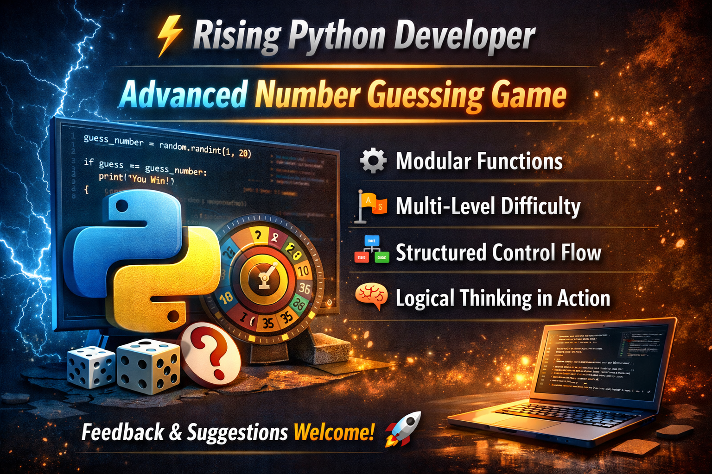

# Number Guessing Game

Interactive Python game with multiple difficulty levels.

## Features
- Random number generation
- User input
- Difficulty levels: Easy, Medium, Hard

## How to Run

1. Clone repository
   git clone https://github.com/shaharyar20-byte/Number-Guessing-Game-in-Python-
2. Go to folder
   cd Number-Guessing-Game-in-Python-
3. Run Python file
   python main.py

## How to Play
1. Run the Python file
2. Enter your name
3. Choose difficulty level
4. Guess the number!

**Developer:** Shaharyar Sheraz