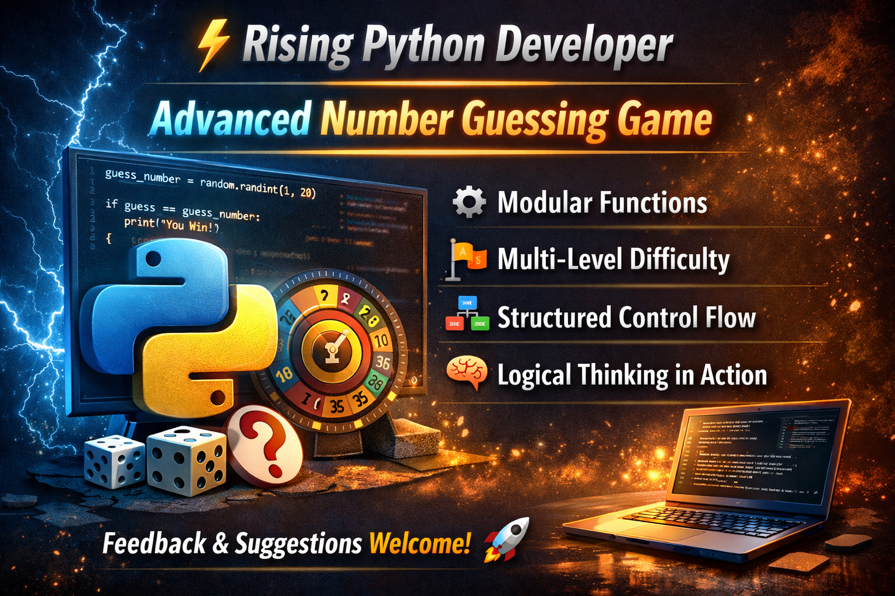

# Number Guessing Game

Interactive Python game with multiple difficulty levels.

## Features
- Random number generation
- User input
- Difficulty levels: Easy, Medium, Hard

## How to Play
1. Run the Python file
2. Enter your name
3. Choose difficulty level
4. Guess the number!

## ⚙️ Requirements
- Python 3.x

## 📄 License
This project is licensed under the MIT License - see the [LICENSE](LICENSE) file for details.

**Developer:** Shaharyar Sheraz
